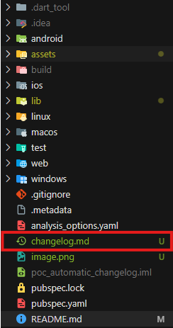
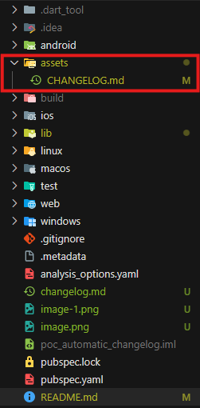
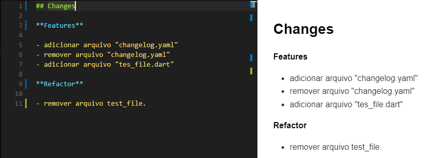

# POC de Geração Automática de Changelogs com Visualização em Flutter

Projeto em Flutter para gerar changelogs automaticamente a partir dos commits no Git e exibir essas informações em tempo real na interface do usuário.  
A ferramenta ajuda a manter changelogs atualizados e visualizáveis sem a necessidade de intervenção manual, utilizando as boas práticas de versionamento de código com *Conventional Commits*.

## Funcionalidades do Projeto

- Geração automática de changelogs a partir de commits no Git.
- Exibição do changelog em uma interface Flutter utilizando o pacote *flutter_markdown*.
- Leitura de arquivos markdown e visualização em tempo real na tela do usuário.
- Suporte a diferentes formatos de saída para o changelog (terminal, arquivos markdown simples e estilizados).

## Pré-requisitos

Antes de utilizar o projeto, certifique-se de que os seguintes pacotes e ferramentas estão instalados:

### Ferramentas
- **Git**: Necessário para a geração dos changelogs com base nos commits. Certifique-se de que o Git está instalado em seu sistema e configurado corretamente.

### Pacotes
- **changelog_cli**: Usado para gerar changelogs automaticamente a partir dos commits. Adicione o pacote com o comando `flutter pub add changelog_cli`.
- **flutter_markdown**: Usado para ler e exibir arquivos markdown no Flutter. Adicione o pacote com o comando `flutter pub add flutter_markdown`.

### Recomendação
Verifique se você está utilizando versões compatíveis do Flutter e do Git. As versões mais recentes são recomendadas.

## Instalação

1. Instale o Git, se ainda não tiver:
    - Para Windows: [Link para instalação do Git](https://git-scm.com/download/win)
    - Para macOS: `brew install git`
    - Para Linux: Utilize o comando apropriado para sua distribuição.

2. Instale o Flutter, se ainda não tiver:
    - Siga as instruções em [Flutter Install](https://flutter.dev/docs/get-started/install).

3. Instale as dependências do projeto:
    - Abra o terminal na raiz do projeto e execute:
    ```bash
    flutter pub add changelog_cli
    flutter pub add flutter_markdown
    ```

4. Após a instalação, você já pode executar os comandos do *changelog_cli* para gerar changelogs e exibi-los na interface.

## Como Usar?

### Requisitos de Conhecimento
Para usar este projeto, é necessário ter conhecimentos sobre *Conventional Commits*, pois o pacote `changelog_cli` utiliza as tags dessa convenção para gerar os changelogs. Exemplos de tags comuns incluem:

- `feat`: Novos recursos.
- `fix`: Correções de bugs.
- `docs`: Atualizações na documentação.
- `style`: Alterações no estilo (formatação, espaçamento, etc.).
- `refactor`: Mudanças no código sem alterar a funcionalidade.

### Exemplo de Commit
A seguir, um exemplo de commit utilizando a tag `feat`:

```
feat: adicionar arquivo "test_file.dart"
- Arquivo adicionado para testes com conventional commits
```

Esse commit seria registrado no changelog da seguinte forma:

```
feat: adicionar arquivo "test_file.dart"
```


### Gerando o Changelog

Há várias formas de gerar o changelog:

1. **Via Terminal (sem arquivo de saída):**
   - Execute o comando `changelog_cli generate` para gerar o changelog diretamente no terminal, sem criar ou atualizar um arquivo.

2. **Via Arquivo Simples:**
   - Para gerar o changelog em um arquivo simples, execute:
     ```bash
     changelog_cli generate > CHANGELOG.md
     ```
     O comando acima cria o arquivo `CHANGELOG.md` na raiz do projeto. Caso o arquivo já exista, ele será atualizado.

3. **Via Arquivo em um Diretório Específico:**
   - Para especificar um caminho para o arquivo:
     ```bash
     changelog_cli generate > assets/CHANGELOG.md
     ```

4. **Via Arquivo Formatado em Markdown:**
   - Para gerar o changelog com markdown formatado, execute:
     ```bash
     changelog_cli generate > assets/CHANGELOG.md --printer markdown
     ```

**Exemplo visual do changelog gerado:**
- Changelog gerado na raiz:



- Changelog gerado em pasta específica:



- Changelog estilizado com markdown:



### Exibindo o Arquivo Markdown no Flutter

Para exibir o conteúdo do arquivo `.md` na tela do usuário, utilize o componente `markdown_reader.dart`. Esse arquivo já foi configurado para ler e renderizar o conteúdo do markdown diretamente no Flutter.

Confira o código do `markdown_reader.dart` para mais detalhes sobre a implementação.

